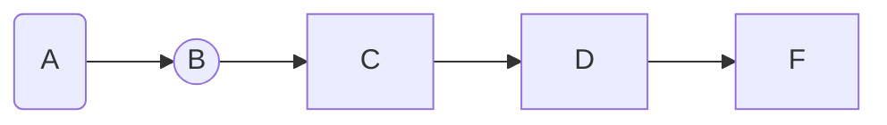
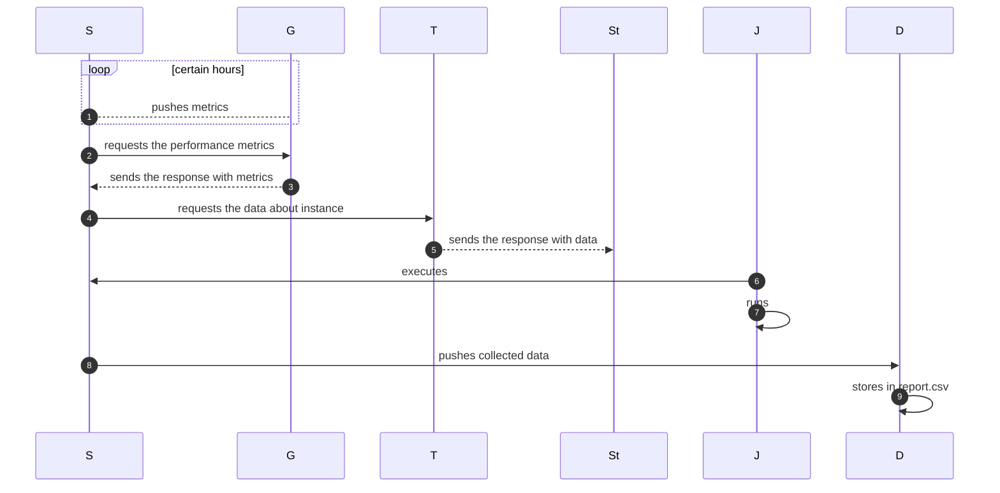

# Design Document

## The purpose of this design

To visualize every stage in the pipeline execution process in order to

## What data will be collected

Daily  logs including the following:

- A ...

## What transformations will be applied

There is no transformations to be done from the engineering side

## Pipeline execution frequency time

Monthly

## How to implemnt changes to scripts

- Permission:
- Risks when changing the script:
- How to make changes: need to make PR
- Who decide reviewers:
A. assigned automatically to anyone in  team (GHE)
B. the person who makes commits from the given list of team members(Bitbucket)
- Who approves changes(merge->deployment): one of the mentioned above assignees

## Monitoring

- Logs are collected and stored
- Individual Slack channel is created for each script
- The person who is on User support/ Pagerduty rotation keeps an eye on the pipelines execution

## Links

|System | Link|
| -------------          |----------         |
|Issue| |
|Bitbucket repo ||

## Data Flow Diagram

## Sequence Diagram

